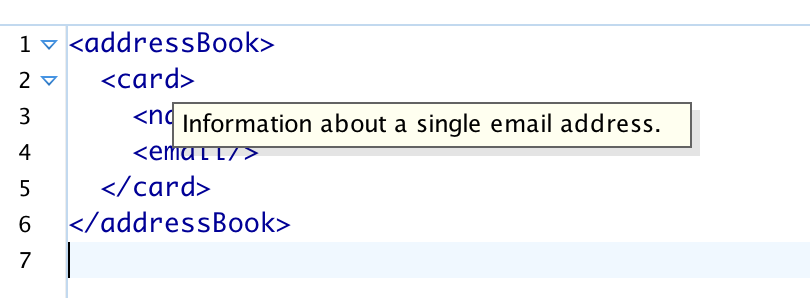

== Anmerkungen (Annotations) ==

RELAX NG hat die praktische Eigenschaft, Elemente und Attribute aus »fremden« Namensräumen einfach zu ignorieren.
Das kann man benutzen, um eigene Elemente hinzuzufügen, z.B. zur Dokumentation.

[source, xml]
-------------------------------------------------------------------------------
<element name="addressBook"
  xmlns="http://relaxng.org/ns/structure/1.0"
  xmlns:a="http://relaxng.org/ns/compatibility/annotations/1.0">
  <zeroOrMore>
    <element name="card">
      <a:documentation>Information about a single email address.</a:documentation>
      <element name="name">
        <text/>
      </element>
      <element name="email">
        <text/>
      </element>
    </element>
  </zeroOrMore>
</element>
-------------------------------------------------------------------------------

Wird der oben genannte Namensraum für die Dokumentation benutzt, so wird dies in manchen Editoren als Tooltip gezeigt.
Hier ist ein Beispiel für das Schema im oXygen XML-Editor

RELAX NG hat auch ein `div`-Element, das keinerlei Bedeutung hat.
Es dient lediglich zur logischen Trennung für den Anwender und hat auf das Anwenden der Regeln keine Auswirkung.
Man könnte mit einem Namensraum selber eine Trennung vornehmen um ein Schema zu modularisieren.

++++
<code class="sidebar">
div
</code>
++++
[source, xml]
-------------------------------------------------------------------------------
<grammar xmlns:m="http://www.example.com/module">

  

    <define name="code"> pattern </define>
    <define name="em"> pattern </define>
    <define name="var"> pattern </define>

  

  

    <define name="p"> pattern </define>
    <define name="ul"> pattern </define>
    <define name="ol"> pattern </define>

  

</grammar>
-------------------------------------------------------------------------------

// Ende der Datei.

